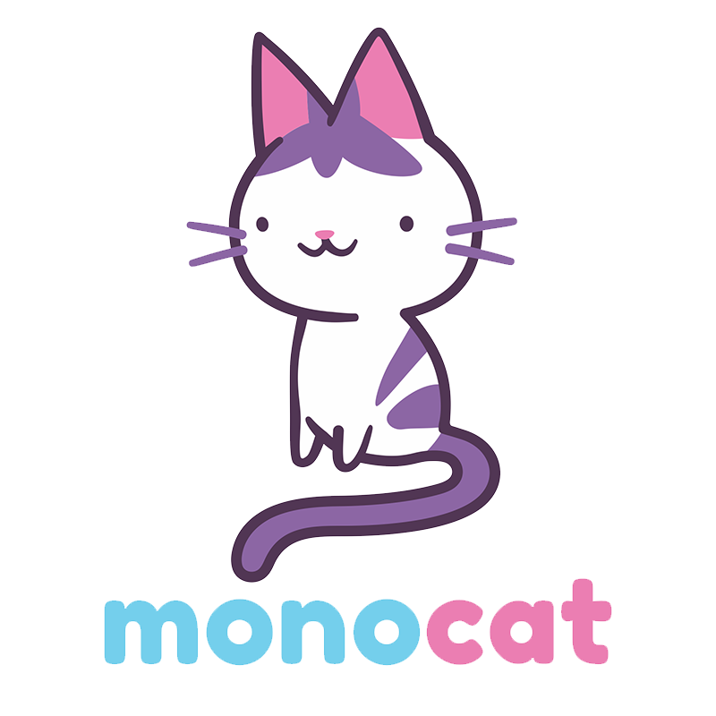

Monocat is a React Native app targeted at toddlers and preschool-aged children that are interested in creating things on the computer, but have yet to develop adequate reading skills for school-aged programs like Scratch Jr.

I have a 4 year-old daughter that insists she'll build robots one day, and that she wants to work and earn monies like I do. I also have a soon-to-be 2 year old son who's obsessed with cause and effect, as well as drawing on everything. I wanted to make something to help keep both of them interested in computer-related STEM projects without getting overwhelmed by how difficult some of the most basic lessons in programming can be at such a young age. That's why the main focus of this project is to create a device-agnostic, IDE-like user experience focused on seeing results fast and having fun!

### Planned Features:
* Create, save and open multiple projects
* A code and style file per project
* A storybook-like help modal for each feature that will verbally explain how to use the feature.
* A visual drag-and-drop editor ux for Kids Who Can't Read Good

### Working on:
- [ ] UX/UI Design
- [X] Basic Scaffolding
- [X] Drag And Drop Functionality
- [X] Sound FX/Music
- [ ] Preview Graphics
- [ ] Adding a color style option and state per chip
- [ ] Modal text and graphics
- [ ] Possibly adding horizontal rules and/or line breaks, and keeping images inline

### Progress: 

---
## Sources

### Images & Fonts
While some of the images were drawn by myself, most iconography used is from [Material Design Icons](https://materialdesignicons.com/). 
All fonts were downloaded from [Google Fonts](https://fonts.google.com/)

### SFX & Music
All audio assets either came from Humble Bundle or Youtube Studio's [Audio Library](https://www.youtube.com/audiolibrary).

- [Cute Game Sounds by Potion Audio](https://potion-audio.itch.io/cute-game-sounds)
- [The Green Orbs](https://www.youtube.com/channel/UCPxH3xieuNcx_O2on0NSMcw)

---
## Development Usage
1. If you do not have expo installed, run `npm install -g expo-cli`
2. Enter the project directory and run `npm i`
3. Run `npm start`, then either use the qr code generated to open the link in your device/emulator's installation of Expo Go, or copy the link from Metro Bundler, open Expo Go, and select the copied link by clicking "Open from Clipboard".